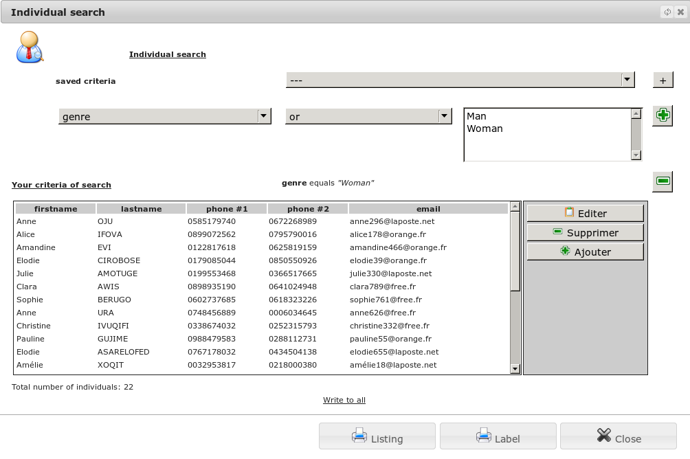

Individuals
===========

Individual is a humain, man or woman, to memorize

List of yours individuals
-------------------------

The menu *Office/Addresses and Contacts/Individuals* allows you to view the list of people you have already registered.As the list can become important, it is possible to filter people by name.

In this screen, you also have the possibility to print the list of people.

.. image:: ListIndividual.png

Edit an individual
------------------

In the previous list, you can add a new person. You can re-edit this file since its show screen.

.. image:: EditIndividual.png

Show a individual
-----------------

In the list of individuals, you have the option of viewing a person.

This will allow you to view the profile of a person previously saved in your database. You can edit this record or print it. You can also give him a connection alias to the associated application to a right of access (see Users). If that person is not referenced in other recordings of the application, you have the option to delete it.

.. image:: ShowIndividual.png

Search a Individual
-------------------

The menu *Office/Addresses and Contacts/Individual search* lets you define a search on an individual.

After validation, the tool will search the database all relevant persons these criteria. You can then print the list or view / edit a form.

  