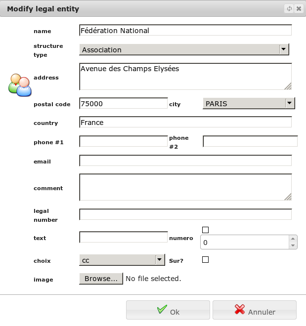
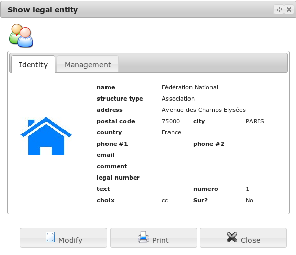

Legal entity
============

A legal entity is a structure or a person of organization (company, association, administration, ...), to memorize.

list of your legal entities
---------------------------

The menu *Office/Addresses and Contacts/Legal entities* lets you consult the list of structures you have already registered. Each moral contact is associated with a category. In this list, you see your structures filtered by these categories.

From this screen, you also have the possibility to print the list of structures. 

.. image:: ListLegalEntity.png

Edit a legal entity
-------------------

In the previous list, you can create a new structure. You can re-edit it in its showing screen. 

Show a legal entity
-------------------

In the list of legal entities, you can view a structure.

This will allow you to view the profile of a previously entered into your database structure. You can edit this record or print it. If that structure is not referenced in other recording application, you can delete it. 

Responsability of a legal entity
--------------------------------

You have the ability to associate an individual to your organization.

Select the new responsible: if the person does not exist in your database, you will be able to create it.You can also add a function to a specific charge. 

.. image:: ResponsabilityLegalEntity.png

Search a legal entity
---------------------

The menu *Office/Addresses and Contacts/Legal entity search* lets you define a search on a moral structure. 

.. image:: FindLegalEntity.png