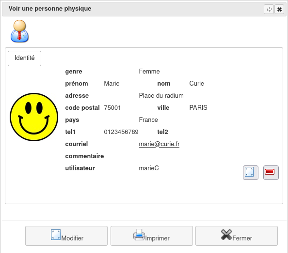
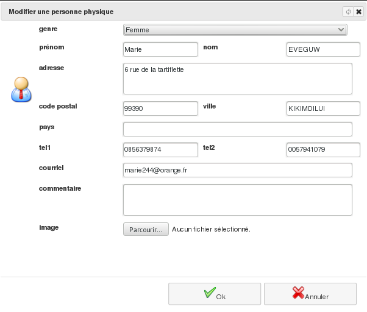

Les contact physiques (personnes physiques)
===========================================

Un contact physique est une personne, homme ou femme, avec qui votre structure est en relation. Il peut s'agir d'un adhérent, d'un copropriétaire mais aussi d'un contact, personne physique, de l'un de vos interlocuteurs (exemple le commercial d'un de vos fournisseurs).

     Menu *Bureautique/Adresses et Contacts/Personnes physiques*

Liste de vos contacts physiques
-------------------------------

La liste des personnes déjà enregistrées s'affiche. Étant donné que celle-ci peut devenir importante, il est possible de filtrer les personnes sur le nom.

Depuis cet écran, vous avez aussi la possibilité d'imprimer la liste des personnes et les étiquettes pour le courrier.

Visualisation d'un contact physique
-----------------------------------

La liste des personnes physiques étant affichée, le bouton "Editer" ou un double-clic sur la ligne correspondante au contact, permettent de visualiser la fiche du contact.

La fiche consultée peut être modifiée, bouton "modifier" et imprimée, bouton "Imprimer".
Si cette personne n'est pas associée à d'autres enregistrements de l'application, vous avez la possibilité de supprimer sa fiche.

Vous pouvez également attribuer au contact physique un alias de connexion à l'application, assorti de droits et de permissions (voir Les utilisateurs).

Ajout d'un contact physique
-----------------------------

Depuis la liste précédente, vous avez aussi la possibilité d'ajouter une nouvelle personne à l'aide du bouton "+ Créer".

Recherche d'un contact physique
-------------------------------

     Menu Bureautique/Adresses et Contacts/Recherche de personne physique
     
Définissez les critères de recherche grâce à quoi seront extraites de la base toutes les fiches y satisfaisant.
Vous pourrez alors imprimer cette liste ou visualiser/modifier une fiche.

.. image:: FindIndividual.png

Les critères de filtre peuvent être sauvegardés pour une utilisation ultérieure.
