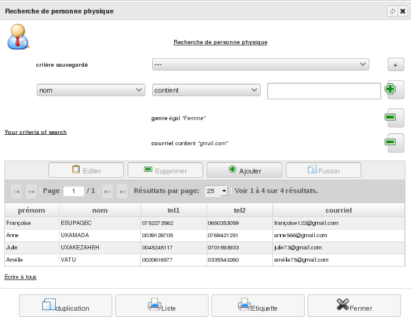

Les contact physiques
=====================

Un contact physique est une personne, homme ou femme, à mémoriser.

Liste de vos contacts physiques
-------------------------------

Le menu *Bureautique/Adresses et Contacts/Personnes Physiques* vous permet de consulter la liste des personnes que vous avez déjà enregistrées. Étant donné que la liste peut devenir importante, il est possible de filtrer les personnes par leur nom.

Depuis cet écran, vous avez aussi la possibilité d'imprimer la liste des personnes.

.. image:: ListIndividual.png

Edition d'un contact physique
-----------------------------

Depuis la liste précédente, vous avez la possibilité d'ajouter une nouvelle personne. Vous pouvez ré-éditer cette fiche depuis sa visualisation.

.. image:: EditIndividual.png

Visualisation d'un contact physique
-----------------------------------

Depuis la liste des personnes physiques, vous avez la possibilité de visualiser une personne.

Cela vous permettra de consulter la fiche d'une personne précédemment enregistrée dans votre base. Vous pouvez modifier cette fiche ou l'imprimer. Vous pouvez également lui donner un alias de connexion à l'application associé à un droit d'accès (voir Les utilisateurs). Si cette personne n'est pas référencée dans d'autres enregistrements de l'application, vous avez la possibilité de la supprimer.

.. image:: ShowIndividual.png

Recherche d'un contact physique
-------------------------------

Le menu Bureautique/Adresses et Contacts/Recherche de personne physique de personne physique vous permet de définir un critère de recherche sur une personne physique.

Une fois validé, l'outil va rechercher dans la base toutes les personnes correspondantes à ces critères. Vous pourrez alors imprimer cette liste ou en visualiser/modifier une fiche.

