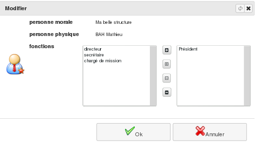

Les contacts moraux (personnes morales)
=======================================

Entreprises, associations, établissements publics, ..., les personnes morales sont des groupements de personnes dotées de la personnalité juridique. Elles peuvent être composées d'une ou de plusieurs personnes, individus ou personnes morales.
Pour chacune des personnes morales avec qui votre structure est en contact, une fiche peut être tenue sous *Diacamma*.

     Menu *Bureautique/Adresses et Contacts/Personnes morales* 

Liste de vos contacts moraux
----------------------------
Vous pouvez consulter la liste des structures pour lesquelles une fiche a déjà été enregistrée.
Chaque contact moral est associé à une catégorie grâce à quoi vous pouvez filtrer la liste des contacts sur le type de structures.

.. image:: ListLegalEntity.png

Depuis cet écran, vous avez aussi la possibilité d'imprimer la liste des structures avec le bouton "Liste" et pouvez imprimer les étiquettes pour le courrier.

Une nouvelle fiche est ouverte à l'aide du bouton "+ Créer" et toute fiche peut être supprimée, à la condition de ne pas être associée à un autre enregistrement de votre base (exemple une facture saisie).

Visualisation d'un contact moral
--------------------------------

Depuis la liste précédente, la fiche d'une structure peut être visualisée à l'aide du bouton "Editer" ou d'un double-clic sur la ligne correspondante au contact.

.. image:: ShowLegalEntity.png

Cette fiche peut ensuite être imprimée avec le bouton du même nom.

Modifier un contact moral
--------------------------
La fiche étant toujours à l'écran, utilisez le bouton "Modifier" pour y apporter toute correction.

.. image:: EditLegalEntity.png

Responsables d'un contact moral
-------------------------------

Vous avez la possibilité d'associer une personne physique à un contact moral : onglet "Membres" et bouton "+ Ajouter".
Sélectionnez la personne physique. Si elle n'est pas répertorié dans votre base, vous avez la possibilité d'y pourvoir.
Tout nouveau membre peut être assorti d'une fonction.

Recherche d'un contact moral
----------------------------

Le menu *Bureautique/Adresses et Contacts/Recherche de personne morale* vous permet d'extraire de votre base les personnes morales satisfaisant aux critères saisis. Ces critères peuvent être sauvegardés pour une utilisation ultérieure.

