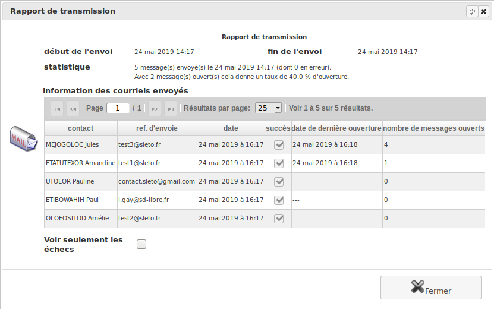

Publipostage
============

     Menu *Bureautique/Publipostage/Messages courriel*

Création d'un message
---------------------

Bouton "+ Ajouter"

Une fois votre message rédigé, validez-le en cliquant sur "Ok". En ouvrant l'onglet "Destinataires", vous allez pouvoir saisir le ou les critères permettant de filtrer vos contacts. Le résultat de la requête est affichée à l'écran. Vous pouvez l'affiner et sauvegarder vos critères pour une utilisation ultérieure.

Votre requête prête, cliquez sur "validée". D'autres requêtes peuvent être ajoutées à la première, leurs résultats se cumulant.
Au moment où votre courrier sera généré, vos requêtes seront de nouveau exécutées, grâce à quoi votre base peut être mise à jour avant *Validation et transmission* des courriers si vous constatez qu'un contact est absent du résultat des requêtes.

Il est également possible de joindre à votre message un ou plusieurs documents sauvegardés dans le *Gestionnaire de documents*. Pour cela, ouvrez l'onglet "Documents".

L'option *document(s) ajouté(s) via liens dans le message* permet d'ajouter un ensemble de liens de partage vers vos documents (et non plus comme pièces jointes). Cela permet la transmission de documents de taille importante ou qui risqueraient d'être supprimés par certains gestionnaires de courriel.

.. image:: mailing.png

Validation & transmission
-------------------------

Une fois le message validé vous pouvez :
 - Soit générer une sortie PDF de l'ensemble des lettres à envoyer, personnalisées avec l'en-tête de chaque contact
 - Soit envoyer votre message par courriel, si celui-ci est correctement configuré. Bien sur, dans ce cas, seuls les contacts possédant une adresse électronique seront impactés par cet envoi.

De plus, dans le cas d'un envoi par courriel, vous pouvez consulter le rapport de transmission. Celui-ci vous indique les courriels envoyés et les éventuelles erreurs d'acheminement.

Si votre logiciel est accessible depuis internet, vous pouvez également consulter le nombre de fois que le destinataire a consulté ce message.
Ce mécanisme se base sur l'acceptation, par votre destinataire des images distantes présentent dans le message.

